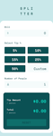

# Frontend Mentor - Tip calculator app solution

This is a solution to the [Tip calculator app challenge on Frontend Mentor](https://www.frontendmentor.io/challenges/tip-calculator-app-ugJNGbJUX). Frontend Mentor challenges help you improve your coding skills by building realistic projects.

## Table of contents

- [Overview](#overview)
  - [The challenge](#the-challenge)
  - [Screenshots](#screenshots)
  - [Links](#links)
- [My process](#my-process)
  - [Built with](#built-with)
  - [What I learned](#what-i-learned)

## Overview

### The challenge

Users should be able to:

- View the optimal layout for the app depending on their device's screen size
- See hover states for all interactive elements on the page
- Calculate the correct tip and total cost of the bill per person

### Screenshots

Click to open the full-size screenshot.

| Mobile                                                                                                   | Desktop                                                                                                     |
| -------------------------------------------------------------------------------------------------------- | ----------------------------------------------------------------------------------------------------------- |
| <a href="./screenshots/mobile.png"></a> | <a href="./screenshots/desktop.png"></a> |

### Links

- Live Site URL: [https://kenyontu.github.io/frontend-mentor-tip-calculator/](https://kenyontu.github.io/frontend-mentor-tip-calculator/)

## My process

### Built with

- React
- Typescript
- CSS modules
- CSS custom properties
- Mobile-first workflow

### What I learned

#### Scaling text down to fit an area

One issue I had was when using big numbers, the result number would overlap other elements and go out of the screen, to counter this, I created a special component for it that would scale down the text based on the length of it.

#### Firefox and absolute positioned buttons

Consider the following example:

```html
<div class="container">
  <button>Button</button>
</div>
```

```css
.container {
  position: relative;
  width: 100px;
  height: 50px;
  background-color: red;
}

.container > button {
  position: absolute;
  top: 0;
  right: 0;
  bottom: 0;
  left: 0;
  background-color: green;
  color: white;
  border: none;
}
```

On Firefox the button will not cover the entire width of the container, one way to fix this is to set `width: 100%`,
